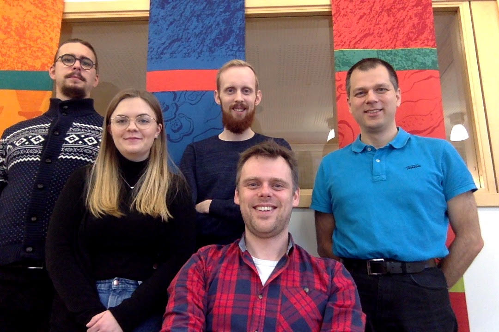
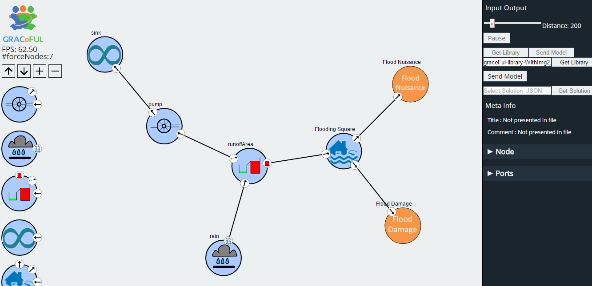
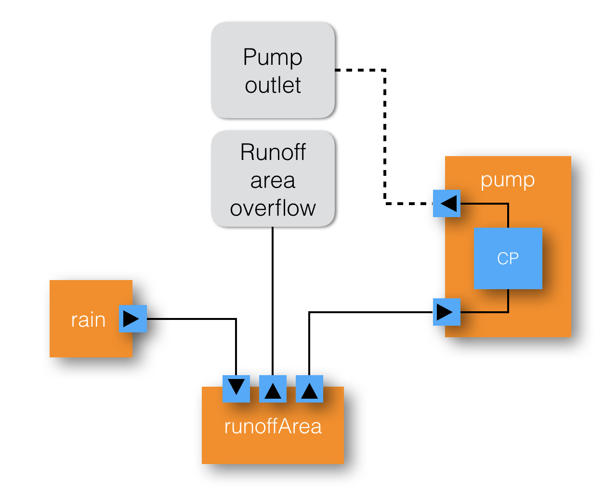

## Organization and personnel

* Site leader: Prof. Patrik Jansson, working 20% for GRACeFUL
* Lecturer: Dr. Alex Gerdes, working 40% for GRACeFUL from 2017-01
* Student research assistants (at 20% each):
    * Maximilian Algehed; Sólrún Einarsdóttir, Oskar Abrahamsson
* 2017-07-01: Sólrún at 100%, Maximilian at 50%, Oskar -> PhD in other proj.



## Tasks

Main task: Build a DSL for translating the concept maps developed and
manipulated during GMB sessions to system dynamics models adequate for
the CFP layer.

The overall purpose of WP4 is to use a DSL for policy concept maps,
logic and relations

* to bridge between
    * the complexity of the CRUD case study from WP2 (visualised in WP3)
* and
    * the underlying science and technology of WP5.

In the longer term this will lead to a DSL aimed at building scalable
RATs for collective policy making in Global Systems.

During the project we will work with embedded DSLs to improve
scalability, verifiability and correctness of the models.

## What are we up to?

* Description of work
    * T4.1 identify key underlying concepts needed for the CRUD case study
    * **T4.2 develop a DSL to describe the concept maps developed during GMB sessions**
    * T4.3 provide a formal semantics for the elements of the DSL
    * **T4.4 implement a middleware for connecting the DSL to the CFP layer**
    * **T4.5 build a testing and verification framework for RATs**

* [Deliverables](../deliverables/)
    * [D4.1](../deliverables/d4.1/) **Done**: Formal description of concept map elements needed for CRUD case study (m6)
    * [D4.2](../deliverables/d4.2/) **Done**: DSL for description of concept maps, with formal semantics (m24)
    * [D4.3](../deliverables/d4.3/) **Translation of concept map descriptions to system dynamics models for the CFP layer (m30)**
    * [D4.4](../deliverables/d4.4/) Testing and verification framework for RATs with applications to the CRUD case study (m36)

## Recent activity: Y2 review VisualEditor demo



## Recent: Software technology used

* Frontend in Javascript: VisualEditor [WP3]
    * Javascript is an untyped functional language
	* We use the Node.js runtime & D3.js Data Driven Documents
* GRACe DSL embedded in Haskell [WP4]
    * Haskell is a strongly typed functional language
	* GRACe programs describe components, contraints, actions
* GRACe server in Haskell (talks to VisualEditor)
    * RESTful Web service (REST = REpresentational State Transfer)
    * Exchange format: JSON = JavaScript Object Notation
* Backend: MiniZinc language
    * encapsulates CFP solver software [WP5]
* Distribution:
    * Source code on Github
	* Binaries as docker containers

## Recent: Deliverable 4.2 ~= a DSL called "GRACe"

* GRACe is a Domain Specific Language, embedded in Haskell
* Can express library components (like `rain`, `pump`, `runoffArea`) ...
* ... and their connections (via ports).
* Frontend: VisualEditor (GUI layer, WP3)
* Backend: MiniZinc language + CFP solver (WP5)

GRACe code for a trivial "rainfall" component.

```haskell
rain :: Float -> GCM (Port Float)
rain amount = do
  port <- createPort
  set port amount
  return port
```

## GRACe: Runoff example structure



## Deliverable 4.2: glue code for the runoff example

```haskell
example :: GCM ()
example = do
  (inflowP, outflowP) <- pump 5
  (inflowR, outletR, overflowR) <- runoffArea 5
  rainflow <- rain 10

  link inflowP outletR
  link inflowR rainflow

  output overflowR "Overflow"
```

which results in the following output when running the solver:

```
ghci> runGCM example
{"Overflow" : 0.0}
```

## GRACe code: `pump`

We model a pump as a `GCM` component parametrised over the maximum
flow through the pump:

```haskell
pump :: Float -> GCM (Port Float, Port Float)
pump maxCap = do
  inPort  <- createPort
  outPort <- createPort
  component $ do             -- This is in CP
    inflow  <- value inPort
    outflow <- value outPort
    assert $  inflow === outflow
    assert $  inflow `inRange` (0, lit maxCap)
  return (inPort, outPort)
```

Note that we need to use `lit` to lift `maxCap`, which is a value in
the host language Haskell, into the embedded language GRACe.

## GRACe code: `runoffArea`

A slightly more complicated component, a water runoff area with an
`inflow`, an `outlet` to which we may connect e.g. a pump, and an
`overflow`.

```haskell
runoffArea :: Float -> GCM (Port Float, Port Float, Port Float)
runoffArea cap = do
  inflow   <- createPort
  outlet   <- createPort
  overflow <- createPort
  component $ do
    currentStored <- createVariable
    inf <- value inflow
    out <- value outlet
    ovf <- value overflow
    sto <- value currentStored
    assert $ sto === inf - out - ovf
    assert $ sto `inRange` (0, lit cap)
    assert $ (ovf .> 0) ==> (sto === lit cap)
    assert $ ovf .>= 0
  return (inflow, outlet, overflow)
```

## GRACe summary

* GRACe is a Domain Specific Language, embedded in Haskell
* Can express library components (like `rain`, `pump`, `runoffArea`) ...
* ... and their connections (via ports).
* Frontend: VisualEditor (GUI layer, WP3)
* Backend: MiniZinc language + CFP solver (WP5)

## Ongoing and next actions (in the next few months)

* Finalise D4.3 (GRACe -> CFP)
* Dissemination: Participate in the International Conference on Functional Programming (Oxford, 2017-09)
* Dissemination: Write papers on DSLs etc.
* Iteratively refine the GRACe DSL
* Develop a test suite: examples + QuickCheck-based automated testing
* Assist WP3 in implementing the graphical user interface, and
* Assist WP2 in building up a library of GRACeFUL Concept Map components expressed in GRACe.

Also ongoing (and overlapping):

* Develop the connection to the Centre of excellence in Global Systems Science
    * Open conference 2017-10-24/25 in Lucca
* Course development of DSLsofMath (Domain Specific Languages of Math's)
    * DSLs, Syntax, Semantics, Proofs, Dissemination, ...
