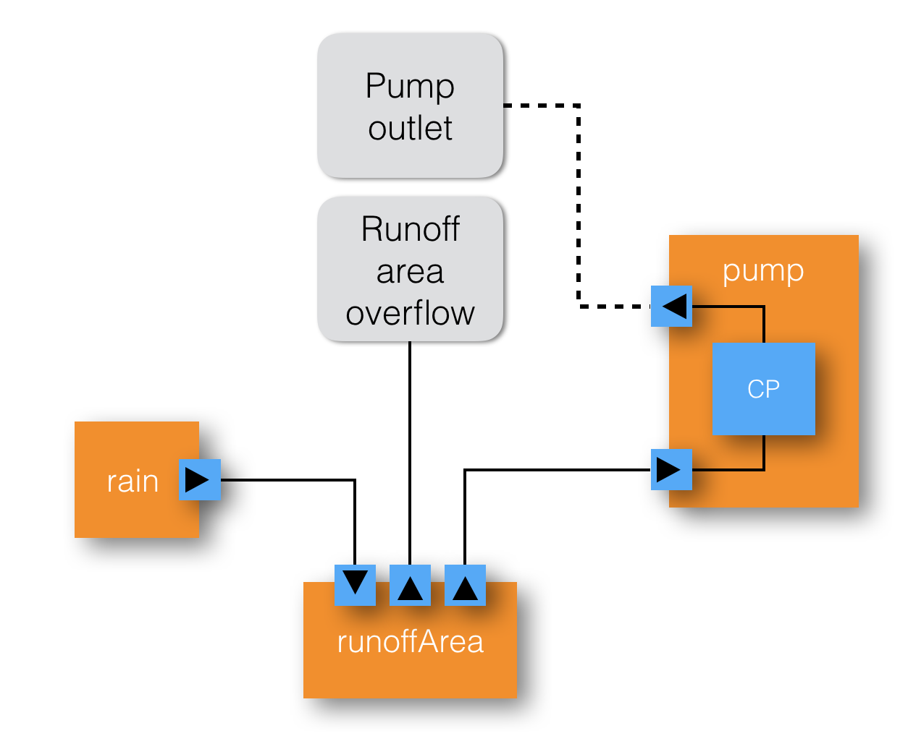

## Going "behind the scenes" of the VisualEditor demo


## Software architecture


## Software technology used

* Frontend in Javascript: VisualEditor [WP3]
    * Javascript is an untyped functional language
	* We use the Node.js runtime & D3.js Data Driven Documents
* GRACe DSL embedded in Haskell [WP4]
    * Haskell is a strongly typed functional language
	* GRACe programs describe components, contraints, actions
* GRACe server in Haskell (talks to VisualEditor)
    * RESTful Web service (REST = REpresentational State Transfer)
    * Exchange format: JSON = JavaScript Object Notation
* Backend: MiniZinc language
    * encapsulates CFP solver software [WP5]
* Distribution:
    * Source code on Github
	* Binaries as docker containers

## WP4: Deliverable 4.2 ~= a DSL called "GRACe"

* GRACe is a Domain Specific Language, embedded in Haskell
* Can express library components (like `rain`, `pump`, `runoffArea`) ...
* ... and their connections (via ports).
* Frontend: VisualEditor (GUI layer, WP3)
* Backend: MiniZinc language + CFP solver (WP5)

GRACe code for a trivial "rainfall" component.

```haskell
rain :: Float -> GCM (Port Float)
rain amount = do
  port <- createPort
  set port amount
  return port
```

## Runoff example structure



## Deliverable 4.2: glue code for the runoff example

```haskell
example :: GCM ()
example = do
  (inflowP, outflowP) <- pump 5
  (inflowR, outletR, overflowR) <- runoffArea 5
  rainflow <- rain 10

  link inflowP outletR
  link inflowR rainflow

  output overflowR "Overflow"
```

which results in the following output when running the solver:

```
ghci> runGCM example
{"Overflow" : 0.0}
```

## GRACe code: `pump`

We model a pump as a `GCM` component parametrised over the maximum
flow through the pump:

```haskell
pump :: Float -> GCM (Port Float, Port Float)
pump maxCap = do
  inPort  <- createPort
  outPort <- createPort
  component $ do             -- This is in CP
    inflow  <- value inPort
    outflow <- value outPort
    assert $  inflow === outflow
    assert $  inflow `inRange` (0, lit maxCap)
  return (inPort, outPort)
```

Note that we need to use `lit` to lift `maxCap`, which is a value in
the host language Haskell, into the embedded language GRACe.

## GRACe code: `runoffArea`

A slightly more complicated component, a water runoff area with an
`inflow`, an `outlet` to which we may connect e.g. a pump, and an
`overflow`.

```haskell
runoffArea :: Float -> GCM (Port Float, Port Float, Port Float)
runoffArea cap = do
  inflow   <- createPort
  outlet   <- createPort
  overflow <- createPort
  component $ do
    currentStored <- createVariable
    inf <- value inflow
    out <- value outlet
    ovf <- value overflow
    sto <- value currentStored
    assert $ sto === inf - out - ovf
    assert $ sto `inRange` (0, lit cap)
    assert $ (ovf .> 0) ==> (sto === lit cap)
    assert $ ovf .>= 0
  return (inflow, outlet, overflow)
```

## GRACe summary

* GRACe is a Domain Specific Language, embedded in Haskell
* Can express library components (like `rain`, `pump`, `runoffArea`) ...
* ... and their connections (via ports).
* Frontend: VisualEditor (GUI layer, WP3)
* Backend: MiniZinc language + CFP solver (WP5)

## Organization and personnel

* Site leader: Prof. Patrik Jansson, working 20% for GRACeFUL
* Lecturer: Dr. Alex Gerdes, working 40% for GRACeFUL from 2017-01
* Student research assistants (at 20% each):
    * Maximilian Algehed; Sólrún Einarsdóttir, Oskar Abrahamsson
* (PhD student: Irene Lobo Valbuena, until 2016-05.)


# Extra slides

## Technical achievements

We have worked mainly on T4.2 and T4.3 of the DSL work package:

* T4.2 develop a **DSL** to describe the concept maps dev. during GMB sessions
* T4.3 provide a formal semantics for the elements of the DSL

This resulted in one deliverable which was handed in on time:

* [D4.2](deliverables/d4.2/): A Domain Specific Language (DSL) for GRACeFUL Concept Maps

and associated
[open source code on GitHub](https://github.com/GRACeFUL-project/GRACe) including
examples and install instructions (through a Docker image).

KULeuven has also contributed by initial work on T4.4

* T4.4 implement a middleware for connecting the DSL to the CFP layer

which will be the main focus after this Y2 review.


## Research publications

Three GRACeFUL-relevant papers in 2016, in different stages of acceptance:

* A: "An Agda Formalisation of the Transitive Closure of Block Matrice" was accepted and published (+presented) at TyDe'16
* B: "Sequential decision problems, dependent types and generic solutions" was accepted to LMCS in Oct. 2016 and is [available on arXiv](https://arxiv.org/abs/1610.07145)
* C: "Contributions to a computational theory of policy advice and avoidability" is under review for JFP (submitted 2016-11)

## Selected meetings and events

* 2016-04: Invited talk "Reproducibility, Proofs and Domain Specific Languages" by Patrik at the [Alan Turing Institute Symposium in Oxford](https://github.com/patrikja/CoeGSS/tree/master/2016-04)
    * Audience: ~70 participants: Data Scientists, Publishers, Librarians, Computer Scientists.
* 2016-06: [GRACeFUL DSL work sprint](https://github.com/GRACeFUL-project/DSL-WP/tree/master/2016-06) (organised at Chalmers)
* 2016-07: Maximilian participated in the WP4-5 work sprint in Barcelona
* 2016-11: Maximilian and Oskar participated in the GRACeFUL work sprint in Delft
* 2016-12: Chalmers org. the GRACeFUL DSL+CFP work sprint (at Chalmers)
  https://github.com/GRACeFUL-project/DSL-WP/tree/master/2016-12
  https://github.com/GRACeFUL-project/DSL-WP/blob/master/2016-12/GRACeFUL-2016-12_Agenda.pdf
* 2017-02: Chalmers org the 5th half-yearly GRACeFUL meeting (at Chalmers)
  https://github.com/GRACeFUL-project/DSL-WP/tree/master/2017-02
