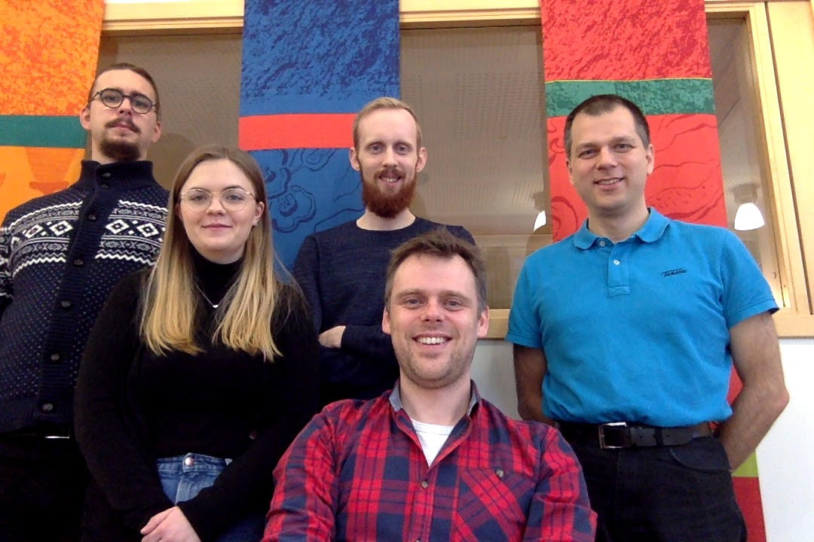
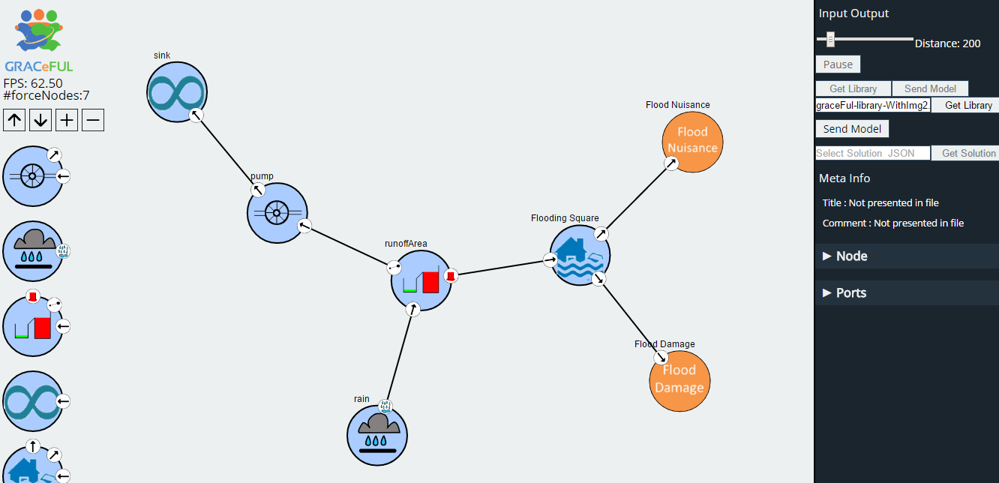

## Organization and personnel

* Site leader: Prof. Patrik Jansson, working 20% for GRACeFUL
* Lecturer: Dr. Alex Gerdes, working 40% for GRACeFUL from 2017-01
* Student research assistants (at 20% each):
    * Maximilian Algehed; Sólrún Einarsdóttir, Oskar Abrahamsson
* 2017-07-01: Sólrún at 100%, Maximilian at 50%, Oskar -> PhD in other proj.

## Tasks

Main task: Build a DSL for translating the concept maps developed and
manipulated during GMB sessions to system dynamics models adequate for
the CFP layer.

The overall purpose of WP4 is to use a DSL for policy concept maps,
logic and relations

* to bridge between
    * the complexity of the CRUD case study from WP2 (visualised in WP3)
* and
    * the underlying science and technology of WP5.

In the longer term this will lead to a DSL aimed at building scalable
RATs for collective policy making in Global Systems.

During the project we will work with embedded DSLs to improve
scalability, verifiability and correctness of the models.

## What are we up to?

* Description of work
    * T4.1 identify key underlying concepts needed for the CRUD case study
    * **T4.2 develop a DSL to describe the concept maps developed during GMB sessions**
    * T4.3 provide a formal semantics for the elements of the DSL
    * **T4.4 implement a middleware for connecting the DSL to the CFP layer**
    * **T4.5 build a testing and verification framework for RATs**

* [Deliverables](../../deliverables/)
    * [D4.1](../../deliverables/d4.1/) **Done**: Formal description of concept map elements needed for CRUD case study (m6)
    * [D4.2](../../deliverables/d4.2/) **Done**: DSL for description of concept maps, with formal semantics (m24)
    * [D4.3](../../deliverables/d4.3/) **Translation of concept map descriptions to system dynamics models for the CFP layer (m30)**
    * [D4.4](../../deliverables/d4.4/) Testing and verification framework for RATs with applications to the CRUD case study (m36)

## Recent activity: Y2 review VisualEditor demo

## Recent: Software technology used in demo

* Frontend in Javascript: VisualEditor [WP3]
    * Javascript is an untyped functional language
	* We use the Node.js runtime & D3.js Data Driven Documents
* GRACe DSL embedded in Haskell [WP4]
    * Haskell is a strongly typed functional language
	* GRACe programs describe components, contraints, actions
* GRACe server in Haskell (talks to VisualEditor)
    * RESTful Web service (REST = REpresentational State Transfer)
    * Exchange format: JSON = JavaScript Object Notation
* Backend: MiniZinc language
    * encapsulates CFP solver software [WP5]
* Distribution:
    * Source code on Github
	* Binaries as docker containers

## Recent: Deliverable 4.2 ~= a DSL called "GRACe"

GRACe summary

* GRACe is a Domain Specific Language, embedded in Haskell
* Can express library components (like `rain`, `pump`, `runoffArea`) ...
* ... and their connections (via ports).
* Frontend: VisualEditor (GUI layer, WP3)
* Backend: MiniZinc language + CFP solver (WP5)

## Recent: GRACe tutorial
We have created a tutorial on how to use the GRACe DSL, where we explain the following:

* What are GRACe components, how are they defined
* How to write GRACe programs written using predefined components
* How to define component libraries to send to the VisualEditor frontend

We will continue to improve the documentation for GRACe to make it more usable.

## Ongoing: Deliverable 4.3 ~= Translation between GRACe and the CFP layer
* Translation of GCM models written in GRACe to constraint programs

 Status:

* Writing work is ongoing, soon-to-be complete
* Draft version will be sent out to GRACeFul partners for comments soon (within the next week)
* On track to be handed in before end-of-July deadline

## Contents of Deliverable 4.3
* Translation of GRACe programs to constraint programs in the MiniZinc language via WP5's haskelzinc DSL
* How GRACe components and their connections are expressed in terms of constraint programming
* The layers of the GRACeFUL software stack and how they are connected

## Ongoing and next actions (in the next few months)

* Finalize D4.3 (GRACe -> CFP)
* Dissemination: Participate in the International Conference on Functional Programming (Oxford, 2017-09)
* Dissemination: Write papers on DSLs etc.
* Iteratively refine the GRACe DSL
* Develop a test suite: examples + QuickCheck-based automated testing

## Ongoing and next actions (in the next few months)
* Assist WP3 in implementing the graphical user interface and connecting it to GRACe.
* Assist WP2 in building up a library of GRACeFUL Concept Map components expressed in GRACe.

Also ongoing (and overlapping):

*  Develop the connection to the Centre of excellence in Global Systems Science
    * Open conference 2017-10-24/25 in Lucca
* Course development of DSLsofMath (Domain Specific Languages of Math's)
    * DSLs, Syntax, Semantics, Proofs, Dissemination, ...
